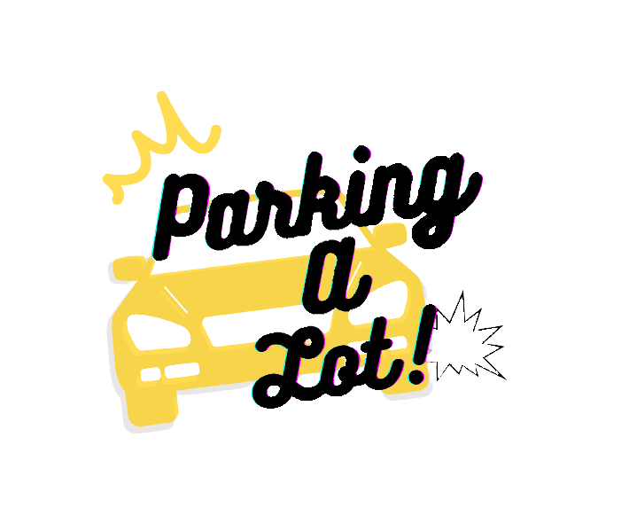
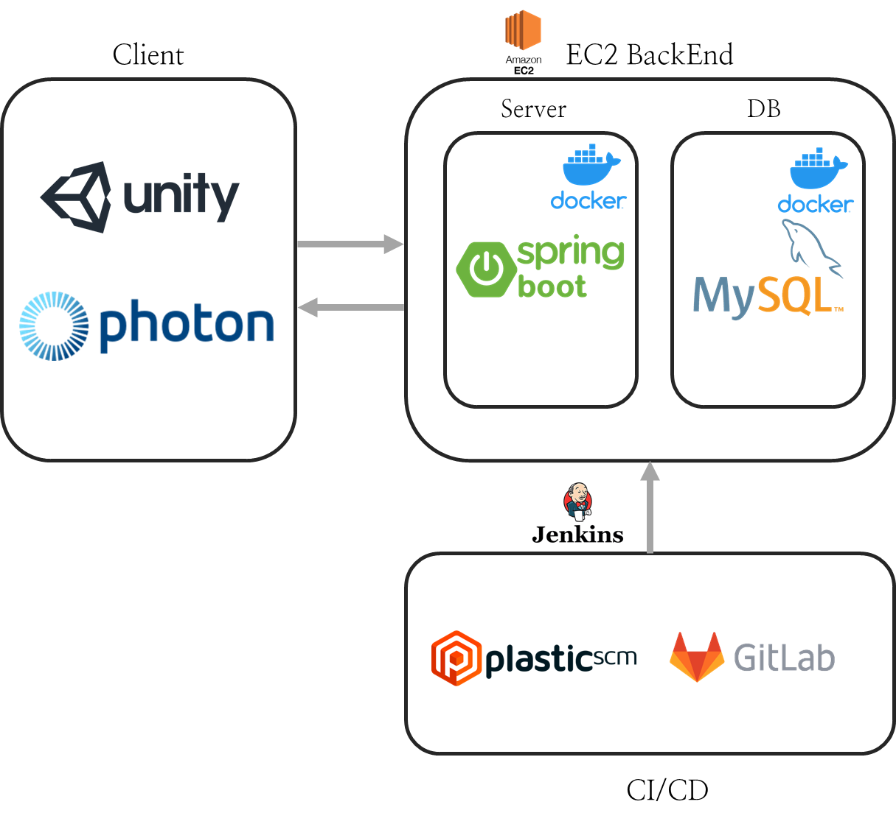
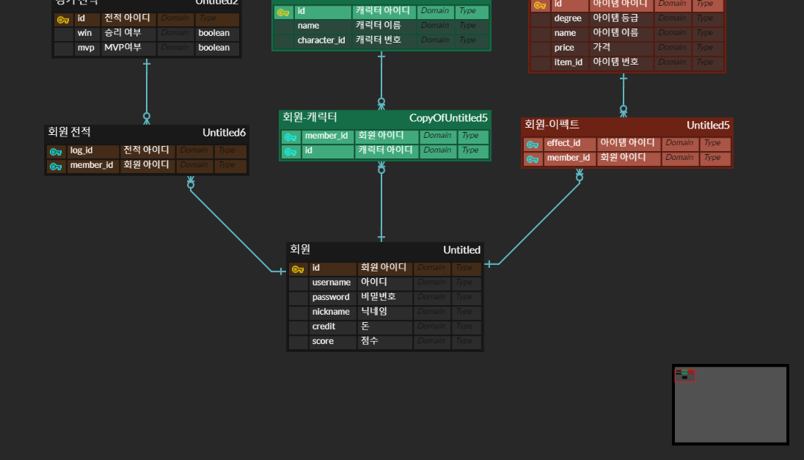

# 🚗 Parking A Lot
### 🎡 [폭주족들의 우당탕탕 발렛 파킹!, Parking A Lot](video_url) 🎡
!


<br/>

## ⌛️ 프로젝트 진행 기간
### 2023-08-21 ~ 2023-10-06 (6주)


<br/>

## 👪팀원 소개
폭주족들의 발렛 파킹 !! Parking A Lot 게임 개발 팀원들을 소개합니다 

### 🧑 강신욱
- 음향담당, 게임 플레이 부분 UI
- GitHub : [keystore2077](https://github.com/keystore2077)
### 👦 김상현
- 기획 및 맵 제작, 게임 플레이 로직 구현
- GitHub : [whitw](https://github.com/whitw)
### 👨 민정인
- Photon Multiplay 동기화
- GitHub : [chatj97](https://github.com/chatj97)
### 🧒 용효창
- 게임 시스템 UI
- GitHub : [YONG15](https://github.com/YONG15)
### 👨‍🦱 이정현
- 팀장, BackEnd
- GitHub : [duljji](https://github.com/duljji)


<br/>


## 📚 기획 배경
### 📖 [프로젝트 기획](./parking-a-lot-docs/Project-plan.md)


<br/>

## 🧩 협업 도구
### GitLab
### Notion
### JIRA
### Plastic SCM


<br/>

## 📺 서비스 화면
### [기능설명](./parking-a-lot-docs/file/game-pr.mp4)

<br/>

## 📂 시스템 아키텍처
!


<br/>

## 📁 ERD



<br>

## 💕 후기
### 🧑 강신욱
```
엔진도 처음이고 익숙하던 Git도 못써서 많이 걱정했는데 재미있는 경험을 할 수 있어서 역시 해보길 잘한거 같아요!
새로운 툴들을 많이 배우는 기회가 되었던거 같습니다. 우리 팀원들 다들 고생하셨어요! 


```
### 👦 김상현
```
인원도 적고 시간도 짧아 긴장을 많이 했는데, 문제 없이 일정을 잘 맞추고 결과 자체도 굉장히 좋게 나와서 만족스럽습니다.
일정 관리와 회의를 적극적으로 활용한 덕이 아니었나 싶습니다.
다들 수고 많으셨습니다! 감사합니다.
```

### 👨 민정인
```
게임을 만들어간다는 재미를 느낄 수 있어 좋았습니다
멀티플레이 동기화를 진행하며 정말 다양한 부분에 동기화가 필요하다는 점을 알 수 있었고, 게임 개발에 정말 많은 노력이 든다는 것을 느꼈습니다
동기화 작업에만 몰두하느라 클라이언트에 깊은 관심을 가지지 못했지만, 팀원들이 모두 기능 구현이나 플레이에 있어서 실력을 발휘해준 덕분에 좋은 프로젝트로 마무리될 수 있어서 좋았습니다
```
### 🧒 용효창
```
7주 동안의 게임 개발 프로젝트를 통해 팀원 간의 협업의 중요성, 타이트한 일정 관리의 필요성, 그리고 사용자 피드백의 가치를 깊이 이해하게 되었습니다. 짧지만 굵은 시간 동안 얻은 경험과 배움은 앞으로의 게임 개발 여정에 큰 자양분이 될 것입니다.
```

### 👨‍🦱 이정현
```
역시 프로그래밍을 전공으로 한 사람들은 뭐가 달라도 다르구나를 알게 해 준 프로젝트였습니다. 꾸준한 코딩리뷰를 통한 협업, 그리고 남다른 코딩 생산성까지 정말 뛰어난 팀원들과 함께 할 수 있어 좋았습니다. 다른 팀보다 적은 인원이었지만 재미있는 게임을 완성까지 시킬 수 있어서 즐거웠습니다.
```


<br/>

## 📔 참조 문서
### API명세 - Swagger  참조
### [컨벤션](./parking-a-lot-docs/convention.md)
